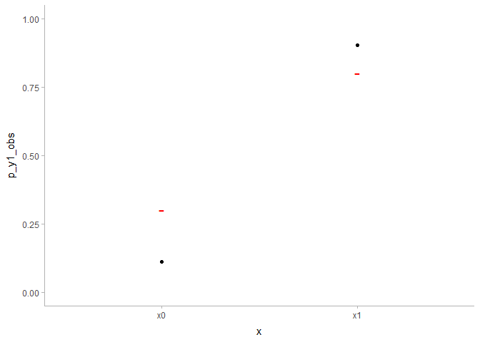
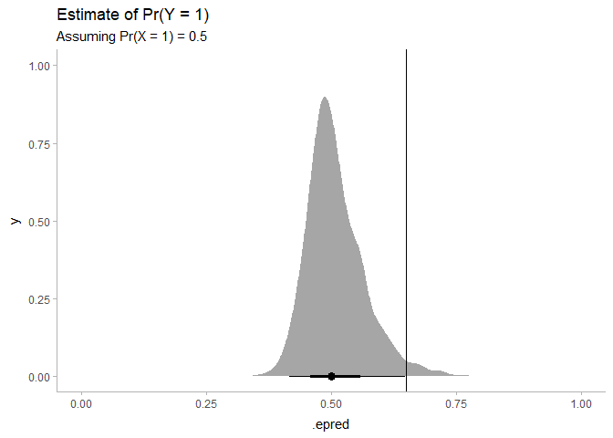
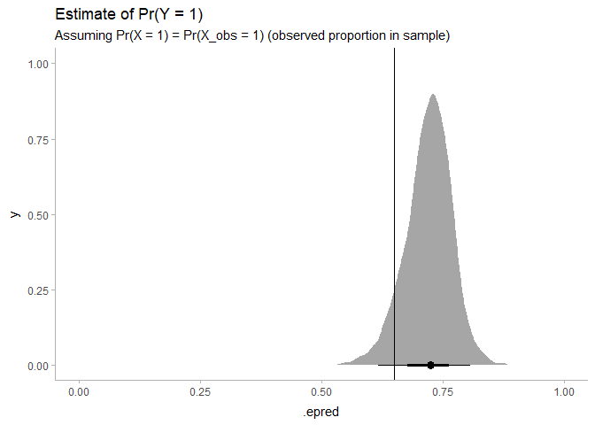
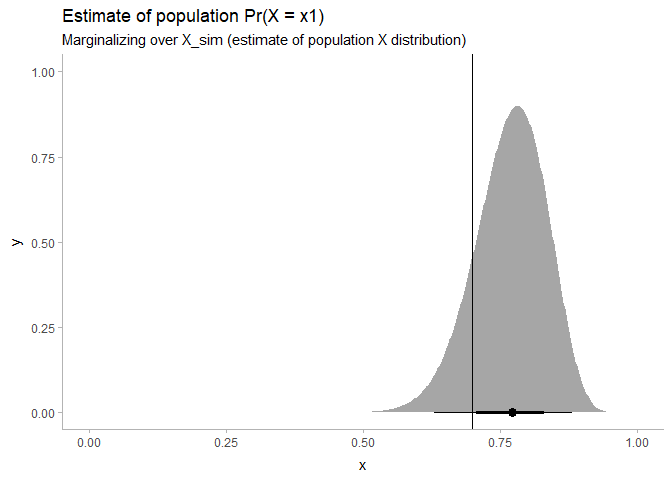

Marginalizing logit models
================
Matthew Kay
2022-11-29

``` r
library(tidyverse)
library(distributional)
library(ggdist)
library(tidybayes)
library(rstanarm)

theme_set(theme_ggdist())
```

N.B. this is an attempt to think through some ideas from [this Twitter
thread](https://twitter.com/adamjnafa/status/1597504851420024832), **DO
NOT take it as authoritative**.

## Data

Let’s generate some data from a population with one predictor (`x`)
having two categories in whose relative proportion is not 50-50, and one
response variable (`y`) whose outcome probability depends on `x`:

``` r
p_x1 = 0.7
p_y1 = c(
  x0 = 0.3,
  x1 = 0.8
)

# thus the marginal P(y == 1) is...
marginal_p_y1 = p_y1[["x0"]] * (1 - p_x1) + p_y1[["x1"]] * p_x1

set.seed(1234)
n = 40
df = tibble(
  x = paste0("x", rbinom(n, 1, p_x1)),
  y = rbinom(n, 1, p_y1[x])
)

df
```

    ## # A tibble: 40 × 2
    ##    x         y
    ##    <chr> <int>
    ##  1 x1        1
    ##  2 x1        1
    ##  3 x1        1
    ##  4 x1        1
    ##  5 x0        0
    ##  6 x1        1
    ##  7 x1        1
    ##  8 x1        1
    ##  9 x1        1
    ## 10 x1        1
    ## # … with 30 more rows

Visualizing the data (compared to the true value in red):

``` r
df |>
  group_by(x) |>
  summarize(p_y1_obs = mean(y)) |>
  ggplot(aes(x = x, y = p_y1_obs)) +
  geom_point(aes(y = p_y1[x]), pch = "-", color = "red", size = 6) +
  geom_point() +
  scale_y_continuous(limits = c(0, 1))
```

<!-- -->

Let’s fit a model:

``` r
m = stan_glm(y ~ x, data = df, family = binomial)
```

``` r
m
```

    ## stan_glm
    ##  family:       binomial [logit]
    ##  formula:      y ~ x
    ##  observations: 40
    ##  predictors:   2
    ## ------
    ##             Median MAD_SD
    ## (Intercept) -2.2    1.1  
    ## xx1          4.5    1.2  
    ## 
    ## ------
    ## * For help interpreting the printed output see ?print.stanreg
    ## * For info on the priors used see ?prior_summary.stanreg

## Marginal means

### Assuming equal probabilities of predictors

If we want the marginal mean for `Pr(y == 1)`, we can do a few things.
One is calculate it assuming equal proportions of the two categories:

``` r
mean_equal_df = df |>
  tidyr::expand(x) |>
  add_epred_draws(m) |>
  # marginalize out x, where P(x1) == P(x2) == 0.5
  group_by(.draw) |>
  summarise(.epred = mean(.epred)) |>
  mutate(method = "equal prob")

mean_equal_df |>
  ggplot(aes(x = .epred)) +
  stat_halfeye() +
  geom_vline(xintercept = marginal_p_y1) +
  xlim(c(0,1)) +
  labs(
    title = "Estimate of Pr(Y = 1)",
    subtitle = "Assuming Pr(X = 1) = 0.5"
  )
```

<!-- -->

Note how this leads to a biased result because we assumed
`Pr(x = x1) = 0.5` yet it is actually 0.7. This makes sense if we think
about what we’re doing mathematically, which is something like:

$$
\begin{eqnarray}
\E_{X_\mathrm{equal}}(Y) &=& \E(Y|X_\mathrm{equal} = 0)\cdot \Pr(X_\mathrm{equal} = 0) + \E(Y|X_\mathrm{equal} = 1)\cdot \Pr(X_\mathrm{equal} = 1)\\
&=& \E(Y|X_\mathrm{equal} = 0) \cdot 0.5 + \E(Y|X_\mathrm{equal} = 1) \cdot 0.5
\end{eqnarray}
$$

When we want to be marginalizing (ideally) over $X$, i.e. the population
distribution of `x`, not an assumed $X_equal$.

### Using sample proportions of predictors

We could assume sample proportions of predictors reflects the
population. The sample proportions are:

``` r
prop.table(table(df$x))
```

    ## 
    ##    x0    x1 
    ## 0.225 0.775

``` r
mean_sample_df = df |>
  add_epred_draws(m) |>
  # marginalize out x, using sample proportions of x
  group_by(.draw) |>
  summarise(.epred = mean(.epred)) |>
  mutate(method = "sample prob")

mean_sample_df |>
  ggplot(aes(x = .epred)) +
  stat_halfeye() +
  geom_vline(xintercept = marginal_p_y1) +
  xlim(c(0,1)) +
  labs(
    title = "Estimate of Pr(Y = 1)",
    subtitle = "Assuming Pr(X = 1) = Pr(X_obs = 1) (observed proportion in sample)"
  )
```

<!-- -->

Now we have a more sensible estimate, but I would bet that the coverage
is not nominal if we checked its calibration — because we used the
sample proportion for `x == x1`, which is 0.775, instead of the true
proportion, which is 0.7.

In essence, if we observed $X_\mathrm{obs}$, we are now doing:

$$
\begin{eqnarray}
\E_{X_\mathrm{obs}}(Y) &=& \E(Y|X_\mathrm{obs} = 0)\cdot \Pr(X_\mathrm{obs} = 0) + \E(Y|X_\mathrm{obs} = 1)\cdot \Pr(X_\mathrm{obs} = 1)\\
\end{eqnarray}
$$

Yet there is uncertainty in $X_\mathrm{obs}$ as an approximation of the
population $X$, and this uncertainty is not propogated in the above
equation.

### Using a model of the population x

What we really want to do is have some approximation of the population
$X$ that incorporates uncertainty, say $\tilde{X}$. Then we can do
something like:

$$
\begin{eqnarray}
\E_{\tilde{X}}(Y) &=& \E(Y|\tilde{X} = 0)\cdot \Pr(\tilde{X} = 0) + \E(Y|\tilde{X} = 1)\cdot \Pr(\tilde{X} = 1)\\
\end{eqnarray}
$$

We could use bootstrapping to generate samples from $\tilde{X}$, but
I’ll be Lazy (TM) and just use a Beta-binomial model of proportions with
Jeffreys’ prior, since it is easy to calculate:

``` r
x_alpha = 0.5 + table(df$x)["x1"]
x_beta = 0.5 + table(df$x)["x0"]

ggplot() +
  stat_halfeye(aes(xdist = dist_beta(x_alpha, x_beta))) +
  geom_vline(xintercept = p_x1) +
  labs(
    title = "Estimate of population Pr(X = x1)",
    subtitle = "Marginalizing over X_sim (estimate of population X distribution)"
  )
```

<!-- -->

Now lets marginalize over $\tilde{X}$:

``` r
mean_sim_df = df |>
  tidyr::expand(x) |>
  add_epred_draws(m) |>
  # generate a distribution of Pr(X_sim = x) values
  mutate(
    p_x1 = rbeta(n(), x_alpha, x_beta),
    p_x = ifelse(x == "x1", p_x1, 1 - p_x1)
  ) |>
  group_by(.draw) |>
  # marginalize out X_sim
  summarise(.epred = weighted.mean(.epred, p_x)) |>
  mutate(method = "estimated pop prob")

mean_sim_df |>
  ggplot(aes(x = .epred)) +
  stat_halfeye() +
  geom_vline(xintercept = marginal_p_y1) +
  xlim(c(0,1)) +
  labs(
    title = "Estimate of Pr(Y = 1)",
    subtitle = "Using estimate of population Pr(X = 1) with uncertainty"
  )
```

<!-- -->

### Comparing the methods

``` r
bind_rows(
  mean_equal_df,
  mean_sample_df,
  mean_sim_df
) |>
  ggplot(aes(y = method, x = .epred)) +
  stat_halfeye() +
  geom_vline(xintercept = marginal_p_y1) +
  xlim(c(0,1)) +
  labs(
    title = "Estimate of Pr(Y = 1)"
  )
```

<!-- -->
