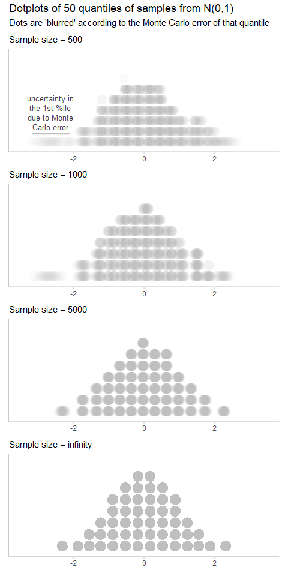

Quantile dotplots with Monte Carlo error
================

## Introduction

This is an attempt to play with adding Monte Carlo standard errors to
quantile dotplots by “blurring” (sort of) each quantile according to its
error.

## Setup

``` r
library(tidyverse)
library(ggplot2)
library(posterior)   # remotes::install_github("stan-dev/posterior")
library(ggdist)
library(patchwork)
library(distributional)

theme_set(theme_ggdist())

knitr::opts_chunk$set(
  dev.args = list(png = list(type = "cairo"))
)
```

## The problem

[Quantile
dotplots](https://github.com/mjskay/when-ish-is-my-bus/blob/master/quantile-dotplots.md)
are a useful way to summarize a distribution by plotting a number of
quantiles (often 20, 50, or 100). However, when obtaining samples from
Bayesian posterior distributions using Monte Carlo methods, there is
uncertainty not captured purely by looking at the posterior quantiles:
the quantiles themselves have error associated with them due to the
Monte Carlo sampling process.

The (currently experimental) [posterior](https://mc-stan.org/posterior/)
package allows calculation of this error using
[`posterior::mcse_quantile()`](https://mc-stan.org/posterior/reference/mcse_quantile.html),
but it is hard to show **two levels** of uncertainty at the same time.

This is one attempt to do that, by showing both 50 quantiles from a
sample from a distribution *and* the uncertainty in those quantiles.
Here I am “blurring” each quantile by overlaying 20 semitransparent
quantiles of each quantile taken according to the Monte Carlo standard
error of each quantile:

``` r
n_dot = 50 # number of dots (quantiles) of the sample to take
n_rep = 20 # number of replicates (quantiles) of each dot to create "blur"

annotation_color = "gray25"

scales = function(n) list(
  labs(
    y = NULL,
    x = NULL,
    subtitle = paste0("Sample size = ", n)
  ),
  scale_x_continuous(limits = c(-3.5, 3.5)),
  scale_y_continuous(breaks = NULL)
)

mcse_dotplot = function(n = 500, annotate_mcse = TRUE) {
  set.seed(1234)
  x = rnorm(n)
  
  df = tibble(
      dot = 1:n_dot,
      q_mean = quantile(x, probs = ppoints(n_dot)),
      q_se = mcse_quantile(x, ppoints(n_dot), names = FALSE)
    ) %>%
    group_by(dot) %>%
    summarise(.groups = "drop",
      rep = 1:n_rep,
      q = qnorm(ppoints(n_rep), q_mean, q_se)
    )
  
  df %>%
    ggplot(aes(y = 0, x = q, group = rep)) +
    stat_dots(layout = "bins", alpha = 1/n_rep, color = NA) +
    (if (annotate_mcse) list(
      geom_line(
        aes(group = NA), y = 0.14, data = df %>% filter(dot == 1, rep %in% range(rep)),
        color = annotation_color
      ),
      geom_text(
        y = 0.18, vjust = 0, label = "uncertainty in\nthe 1st %ile\ndue to Monte\nCarlo error",
        data = df %>% filter(dot == 1, rep == floor(n_rep/2)),
        lineheight = 1,
        color = annotation_color,
        # fontface = "bold",
        size = 3.5
      )
    )) +
    scales(n)
}

theoretical_plot = tibble(mean = 0) %>%
  ggplot(aes(y = 0, dist = dist_normal(mean, 1))) +
  stat_dist_dots(color = NA, quantiles = n_dot, fill = "gray75") +
  scales("infinity")


mcse_dotplot(annotate_mcse = TRUE) /
  mcse_dotplot(n = 1000, annotate_mcse = FALSE) /
  mcse_dotplot(n = 5000, annotate_mcse = FALSE) /
  theoretical_plot +
  plot_annotation(
    title = "Dotplots of 50 quantiles of samples from N(0,1)",
    subtitle = "Dots are 'blurred' according to the Monte Carlo error of that quantile", 
  )
```

<!-- -->

## Histogram version

A histogram version based on a [suggestion from Dan
Simpson](https://twitter.com/dan_p_simpson/status/1401051206009561090?s=20).

We’ll bin percentiles using a rolling window based on which percentiles
are within 2 SEs of each other:

``` r
n_quantile = 100 # number of quantiles to use for binning

mcse_histogram = function(n = 500) {

  set.seed(1234)
  x = rnorm(n)
  
  df = tibble(
      q_mean = quantile(x, probs = ppoints(n_quantile)),
      q_se = mcse_quantile(x, ppoints(n_quantile), names = FALSE)
    ) 
  
  # bin the quantiles based on which ones are within 2 SEs of each other
  next_split = -Inf
  bin = 0
  df$bin = sapply(seq_len(nrow(df)), function(i) {
    if (df$q_mean[[i]] > next_split) {
      next_split <<- with(df[i,], q_mean + 2 * q_se)
      bin <<- bin + 1
    }
    bin
  })
  
  # Then we'll figure out non-overlapping boundaries between bins:
  df_bins = df %>%
    mutate(
      lower = q_mean - 2 * q_se,
      upper = q_mean + 2 * q_se,
    ) %>%
    group_by(bin) %>%
    summarise(
      n = n(),
      lower = min(lower),
      upper = max(upper)
    ) %>%
    mutate(
      adj_lower = rowMeans(cbind(lag(upper), lower), na.rm = TRUE),
      adj_upper = rowMeans(cbind(upper, lead(lower)), na.rm = TRUE)
    )
  
  # Now we'll count how many data points in the sample are actually in these
  # bins to determine (1) densities and (2) actual bin boundaries:
  df_bins_densities = df_bins %>%
    mutate(
      data = map2(adj_lower, adj_upper, ~ x[.x <= x & x < .y]),
      n = lengths(data),
      adj_lower = sapply(data, min),
      adj_upper = sapply(data, max),
      density = n / (adj_upper - adj_lower)
    )
  
  tibble(
    # interleave lower and upper to draw histograms edges
    x = with(df_bins_densities, as.vector(rbind(adj_lower, adj_lower, adj_upper, adj_upper))),
    density = with(df_bins_densities, as.vector(rbind(0, density, density, 0)))
  ) %>%
    ggplot(aes(x = x, ymin = 0, ymax = density)) +
    geom_ribbon(color = "white") +
    scales(n)
}

mcse_histogram(500) /
  mcse_histogram(1000) /
  mcse_histogram(5000) /
  mcse_histogram(10000) +
  plot_annotation(
    title = "Histograms of samples from N(0,1)",
    subtitle = "Binned to keep percentiles together if they are within 2*MCSE", 
  )
```

<!-- -->
