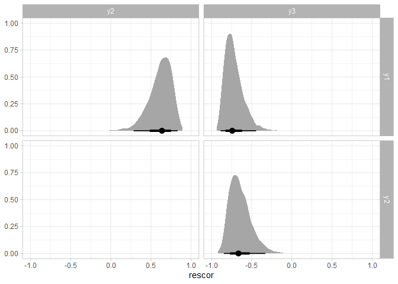
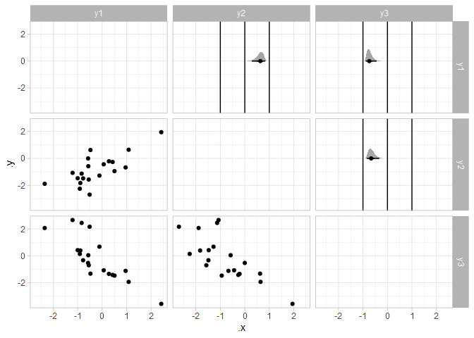
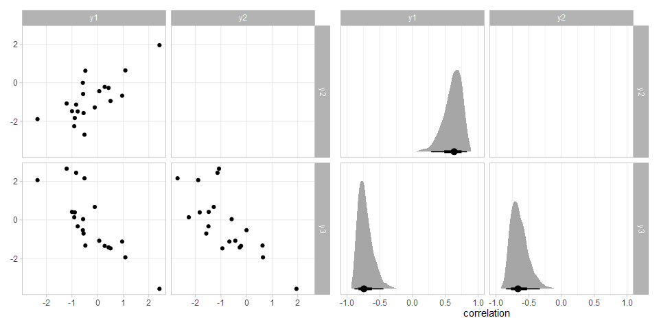
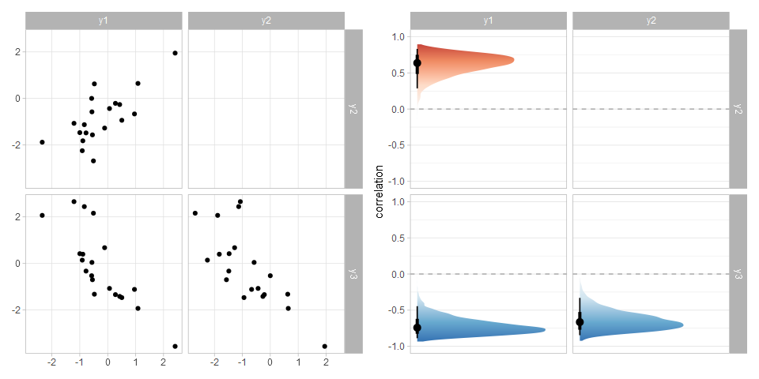
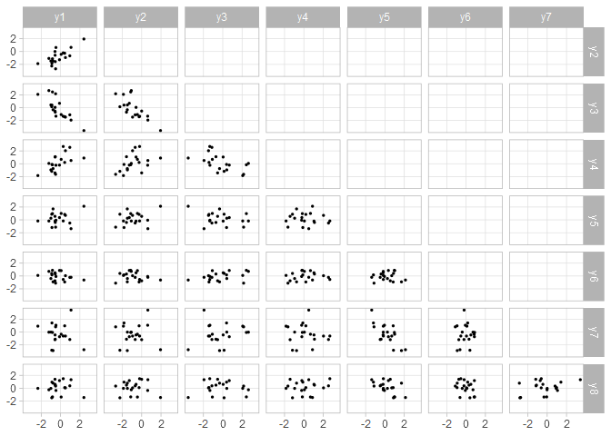
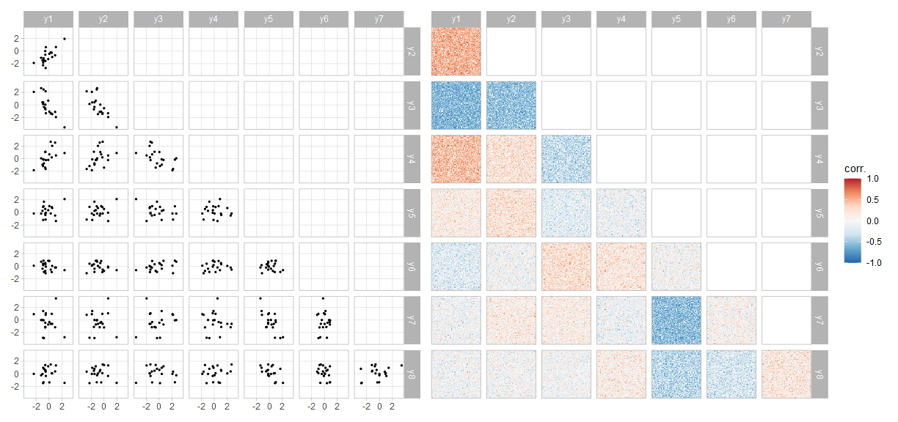
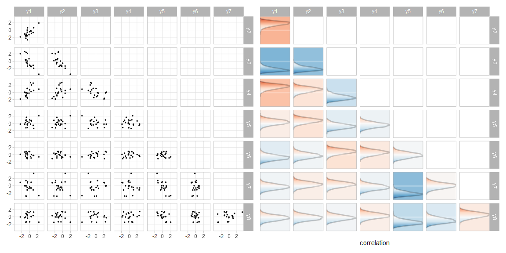
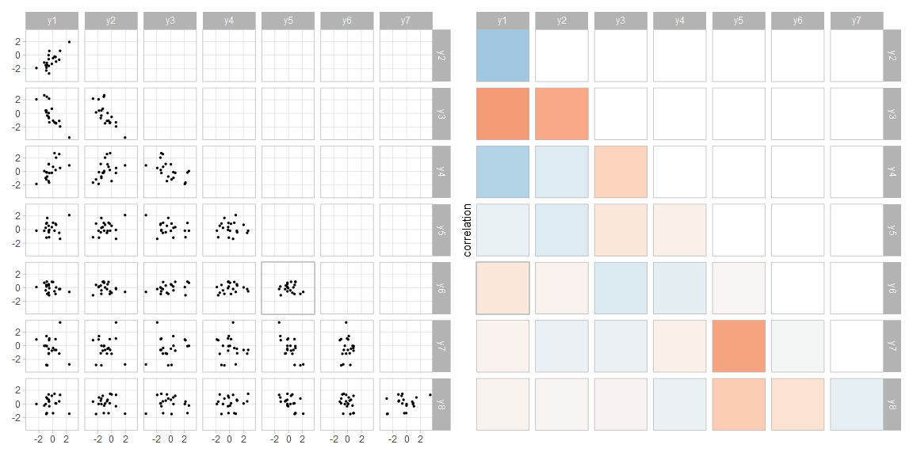
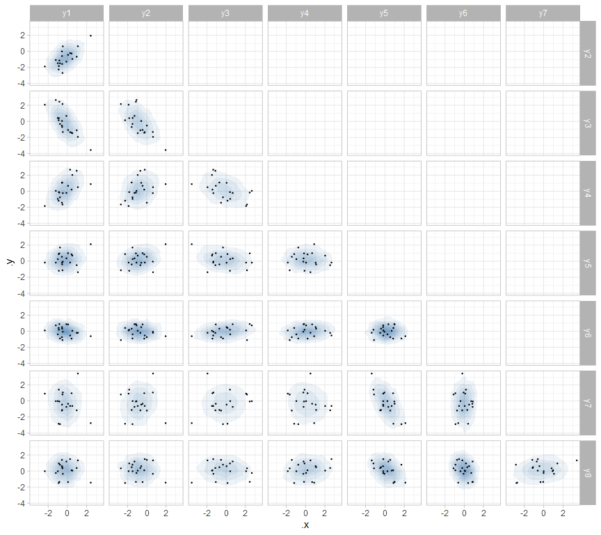

Multivariate regression
================

-   [Setup](#setup)
    -   [Data](#data)
    -   [Data plot](#data-plot)
    -   [Model](#model)
    -   [Correlations from the model](#correlations-from-the-model)
    -   [Altogether](#altogether)
    -   [Or side-by-side](#or-side-by-side)
    -   [More heatmap-y](#more-heatmap-y)
-   [Okay, but does it scale?](#okay-but-does-it-scale)
    -   [Density version](#density-version)
    -   [Dither approach](#dither-approach)
    -   [Densities with heatmaps?](#densities-with-heatmaps)
-   [The no-uncertainty heatmap](#the-no-uncertainty-heatmap)
-   [Posterior predictions](#posterior-predictions)
-   [The directly-in-Stan model](#the-directly-in-stan-model)
    -   [Posterior predictions](#posterior-predictions-1)

## Setup

Libraries that might be of help:

``` r
library(tidyverse)
library(magrittr)
library(ggplot2)
library(rstan)
library(brms)
library(modelr)
library(tidybayes)
library(colorspace)
library(patchwork)

theme_set(theme_light())
rstan_options(auto_write = TRUE)
options(mc.cores = parallel::detectCores())
```

### Data

``` r
set.seed(1234)

df =  tibble(
  y1 = rnorm(20),
  y2 = rnorm(20, y1),
  y3 = rnorm(20, -y1)
)
```

### Data plot

``` r
df %>%
  gather(.variable, .value) %>%
  gather_pairs(.variable, .value) %>%
  ggplot(aes(.x, .y)) +
  geom_point() +
  facet_grid(.row ~ .col)
```

<!-- -->

### Model

``` r
m = brm(mvbind(y1, y2, y3) ~ 0 + intercept, data = df, file = "multivariate-regression_files/model.rds")
```

### Correlations from the model

A plot of the `rescor` coefficients from the model:

``` r
m %>%
  gather_draws(`rescor.*`, regex = TRUE) %>%
  separate(.variable, c(".rescor", ".row", ".col"), sep = "__") %>%
  ggplot(aes(x = .value, y = 0)) +
  stat_halfeye() +
  xlim(c(-1, 1)) +
  xlab("rescor") +
  ylab(NULL) +
  facet_grid(.row ~ .col)
```

<!-- -->

### Altogether

I’m not sure I like this (we’re kind of streching the limits of
`facet_grid` here…) but if you absolutely must have a combined plot,
this sort of thing could work…

``` r
correlations = m %>%
  gather_draws(`rescor.*`, regex = TRUE) %>%
  separate(.variable, c(".rescor", ".row", ".col"), sep = "__")


df %>%
  gather(.variable, .value) %>%
  gather_pairs(.variable, .value) %>%
  ggplot(aes(.x, .y)) +
  
  # scatterplots
  geom_point() +

  # correlations
  geom_halfeyeh(aes(x = .value, y = 0), data = correlations, size = .75) +
  geom_vline(aes(xintercept = x), data = correlations %>% data_grid(nesting(.row, .col), x = c(-1, 0, 1))) +

  facet_grid(.row ~ .col)
```

    ## Warning: 'geom_halfeyeh' is deprecated.
    ## Use 'stat_halfeye' instead.
    ## See help("Deprecated") and help("tidybayes-deprecated").

<!-- -->

### Or side-by-side

Actually, it occurs to me that the traditional “flipped on the axis”
double-scatterplot-matrix can be hard to read, because it is hard to
mentally do the diagonal-mirroring operation to figure out which cell on
one side goes with the other. I find it easier to just map from the same
cell in one matrix onto another, which suggests something like this
might be better:

``` r
data_plot = df %>%
  gather(.variable, .value) %>%
  gather_pairs(.variable, .value) %>%
  ggplot(aes(.x, .y)) +
  geom_point(size = 1.5) +
  facet_grid(.row ~ .col) +
  theme(panel.grid.minor = element_blank()) +
  xlab(NULL)+ 
  ylab(NULL)

rescor_plot = m %>%
  gather_draws(`rescor.*`, regex = TRUE) %>%
  separate(.variable, c(".rescor", ".col", ".row"), sep = "__") %>%
  ggplot(aes(x = .value, y = 0)) +
  geom_halfeyeh() +
  xlim(c(-1, 1)) +
  xlab("rescor") +
  ylab(NULL) +
  facet_grid(.row ~ .col) +
  xlab("correlation") +
  scale_y_continuous(breaks = NULL) 
```

    ## Warning: 'geom_halfeyeh' is deprecated.
    ## Use 'stat_halfeye' instead.
    ## See help("Deprecated") and help("tidybayes-deprecated").

``` r
data_plot + rescor_plot
```

<!-- -->

### More heatmap-y

Some other things possibly worth improving:

-   adding a color encoding back in for that high-level gist
-   making “up” be positive correlation and “down” be negative
-   0 line

``` r
rescor_plot_heat = m %>%
  gather_draws(`rescor.*`, regex = TRUE) %>%
  separate(.variable, c(".rescor", ".col", ".row"), sep = "__") %>%
  ggplot(aes(y = .value, x = 0)) +
  stat_halfeye(aes(fill = stat(y)), fill_type = "gradient") +
  geom_hline(yintercept = 0, color = "gray65", linetype = "dashed") +
  ylim(c(-1, 1)) +
  ylab("correlation") +
  xlab(NULL) +
  scale_x_continuous(breaks = NULL) +
  scale_fill_distiller(type = "div", palette = "RdBu", limits = c(-1, 1), guide = "none") +
  facet_grid(.row ~ .col)

data_plot + rescor_plot_heat
```

<!-- -->

## Okay, but does it scale?

Let’s add some more variables…

``` r
set.seed(1234)

df_large =  tibble(
  y1 = rnorm(20),
  y2 = rnorm(20, y1),
  y3 = rnorm(20, -y1),
  y4 = rnorm(20, 0.5 * y1),
  y5 = rnorm(20),
  y6 = rnorm(20, -.25 * y1),
  y7 = rnorm(20, -y5),
  y8 = rnorm(20, -0.5 * y5)
)
```

``` r
data_plot_large = df_large %>%
  gather(.variable, .value) %>%
  gather_pairs(.variable, .value) %>%
  ggplot(aes(.x, .y)) +
  geom_point(size = .5) +
  facet_grid(.row ~ .col) +
  theme(panel.grid.minor = element_blank()) +
  xlab(NULL) +
  ylab(NULL)

data_plot_large
```

<!-- -->

``` r
m_large = brm(mvbind(y1, y2, y3, y4, y5, y6, y7, y8) ~ 1, data = df_large, file = "multivariate-regression_files/model_large.rds")
```

### Density version

The real goal here is to create a “micro-macro” reading. The advantage
of the original heatmap is the “macro” reading: you can step back from
the plot and see the “big picture” of the pattern of correlations in
each cell, but you can’t see uncertainty. The “micro” reading is details
of the uncertainty in each cell, which the heatmap does not support.

Here we’ll try to make it easy to see the big picture using densities
(actually, violins / eye plots - I find the symmetry helps in the case)
colored according to the correlation color scale. This gives us a
“micro” reading, and then the average color of the eye in a cell is the
average correlation value. I also added a subtle white line for 0 on top
to make the difference between positive and negative correlations a bit
easier to see:

``` r
rescor_plot_heat_large = m_large %>%
  gather_draws(`rescor.*`, regex = TRUE) %>%
  separate(.variable, c(".rescor", ".col", ".row"), sep = "__") %>%
  ggplot(aes(y = .value, x = 0)) +
  geom_hline(yintercept = 0, color = "gray95", size = 1, alpha = 0.75, linetype = "11") +
  stat_halfeye(aes(fill = stat(y)), fill_type = "gradient", side = "both", color = alpha("black", 0.2), point_size = 1) +
  ylab("correlation") +
  xlab(NULL) +
  scale_x_continuous(breaks = NULL) +
  scale_y_continuous(breaks = NULL, limits = c(-1, 1)) +
  scale_fill_distiller(type = "div", palette = "RdBu", limits = c(-1, 1), guide = "none") +
  facet_grid(.row ~ .col) 

(data_plot_large + rescor_plot_heat_large) &
  theme(panel.spacing = unit(0, "pt"))
```

<!-- -->

### Dither approach

A different, more frequency-framing approach, would be to use dithering
to show uncertainty (see e.g. Figure 4 from [this
paper](http://doi.wiley.com/10.1002/sta4.150)). This is akin to
something like an icon array. You should still be able to see the
average color (thanks to the human visual system’s ensembling
processing), but also get a sense of the uncertainty by how “dithered” a
square looks:

``` r
w = 60
h = 60

rescor_plot_heat_dither = m_large %>%
  gather_draws(`rescor.*`, regex = TRUE) %>%
  separate(.variable, c(".rescor", ".col", ".row"), sep = "__") %>%
  group_by(.row, .col) %>%
  summarise(
    .value = list(sample(.value, w * h)),
    x = list(rep(1:w, times = h)),
    y = list(rep(1:h, each = w)),
    .groups = "drop_last"
  ) %>%
  unnest(cols = c(.value, x, y)) %>%
  ggplot(aes(x, y, fill = .value)) +
  geom_raster() +
  facet_grid(.row ~ .col) +
  scale_fill_distiller(type = "div", palette = "RdBu", limits = c(-1, 1), name = "corr.") +
  scale_y_continuous(breaks = NULL) +
  scale_x_continuous(breaks = NULL) +
  xlab(NULL) +
  ylab(NULL) +
  coord_cartesian(expand = FALSE)

data_plot_large + rescor_plot_heat_dither
```

<!-- -->

### Densities with heatmaps?

Going back to densities, what if the point estimate is used to set the
cell backgorund — maybe that will help that format have a high-level
gist while retaining its more accurate depiction of the uncertainty:

``` r
rescor_plot_heat_large = m_large %>%
  gather_draws(`rescor.*`, regex = TRUE) %>%
  separate(.variable, c(".rescor", ".col", ".row"), sep = "__") %>%
  ggplot(aes(y = .value, x = 0)) +
  geom_tile(aes(y = 0, x = 0.5, width = 1, height = 2, fill = .value),
    data = function(df) df %>% group_by(.row, .col) %>% median_qi(.value)) +
  stat_slab(aes(fill = stat(y)), normalize = "groups", scale = 1, color = alpha("black", 0.2), fill_type = "gradient") +
  geom_hline(yintercept = 0, color = "white", alpha = .25, size = 1) +
  scale_y_continuous(name = NULL, breaks = NULL, limits = c(-1, 1)) +
  scale_x_continuous(name = "correlation", breaks = NULL) +
  scale_fill_distiller(type = "div", palette = "RdBu", limits = c(-1, 1), guide = "none") +
  facet_grid(.row ~ .col) +
  coord_cartesian(expand = FALSE)

data_plot_large + rescor_plot_heat_large
```

<!-- -->

This is, admittedly, a bit weird…

## The no-uncertainty heatmap

For reference:

``` r
rescor_plot_heat_large = m_large %>%
  gather_draws(`rescor.*`, regex = TRUE) %>%
  separate(.variable, c(".rescor", ".col", ".row"), sep = "__") %>%
  group_by(.row, .col) %>% 
  median_qi(.value) %>%
  ggplot(aes(x = 0, y = 0, fill = .value)) +
  geom_raster() +
  xlab("correlation") +
  ylab(NULL) +
  scale_y_continuous(breaks = NULL) +
  scale_x_continuous(breaks = NULL) +
  scale_fill_distiller(type = "div", palette = "RdBu", direction = 1, limits = c(-1, 1), guide = "none") +
  coord_flip(expand = FALSE) +
  facet_grid(.row ~ .col)

data_plot_large + rescor_plot_heat_large
```

<!-- -->

## Posterior predictions

Let’s look at some posterior predictions as well:

``` r
data.frame(x = 0) %>%
  add_predicted_draws(m_large) %>%
  ungroup() %>%
  select(-.row) %>%
  gather_pairs(.category, .prediction) %>%
  ggplot(aes(x = .x, y = .y)) +
  stat_density_2d(alpha = 1/15, fill = "#08519C", geom = "polygon") +
  geom_point(data = df_large %>% gather_variables() %>% gather_pairs(.variable, .value), size = .5, pch = 20) +
  scale_fill_distiller(direction = 1, guide = "none") +
  facet_grid(.row ~ .col)
```

<!-- -->

## The directly-in-Stan model

To demo some other useful `tidybayes` features, particularly on nested
data, let’s code up a version of the multivariate regression model
directly in Stan that expects the outcome variable `Y` to be a vector:

``` stan
data {
  int<lower=1> n;            // number of observations
  int<lower=1> n_responses;  // number of response variables
  vector[n_responses] Y[n];  // response matrix
}
parameters {
  vector[n_responses] Mu;
  vector<lower=0>[n_responses] sigma;
  // parameters for multivariate linear models
  cholesky_factor_corr[n_responses] Lrescor;
}
transformed parameters {
  matrix[n_responses, n_responses] LSigma = diag_pre_multiply(sigma, Lrescor);
}
model {
  // priors
  sigma ~ student_t(3, 0, 10);
  Mu ~ normal(0, 10);
  Lrescor ~ lkj_corr_cholesky(1);
  
  // likelihood
  Y ~ multi_normal_cholesky(Mu, LSigma);
} 
generated quantities {
  matrix[n_responses, n_responses] Sigma = multiply_lower_tri_self_transpose(LSigma);
}
```

We’ll use a modified version of the dataset that has the data nested
into a `Y` variable as well:

``` r
nested_df = df %>%
  transmute(Y = pmap(list(y1, y2, y3), c))

nested_df
```

We’ll also keep the long-form paired version of the dataset around since
it will be useful for plotting:

``` r
paired_df = df %>%
  gather(.variable, .value) %>%
  gather_pairs(.variable, .value) 

paired_df %>%
  ggplot(aes(.x, .y)) +
  geom_point() +
  facet_grid(.row ~ .col)
```

To prepare the data for modeling, we can use `compose_data()`, which
will appropriately handle the nested `Y` column for us, generate the `n`
column, and let us easily generate an `n_responses` column (the number
of responses in each vector in `Y`):

``` r
data_for_stan = nested_df %>%
  compose_data(n_responses = length(Y[[1]]))
```

Then we can fit the model:

``` r
mv = sampling(mv_stanmodel, data = data_for_stan, chains = 4, iter = 5000)
```

### Posterior predictions

What we’d really like to be able to do is easily make use of the `Mu`
vector and `Sigma` matrix from the posterior draws. The latest version
of `tidybayes` now supports extracting variables as *nested* list
columns: any dimension you specify as a `.` is nested into the resulting
data frame rather than being moved into a separate column. For example:

``` r
mv %>%
  spread_draws(Mu[.], Sigma[.,.]) %>%
  head(10)
```

This means we can use the `map()` family of functions from `purrr` to
directly make use of posterior draws from the `Mu` vector and the
`Sigma` covariance matrix; for example, we can generate posterior
predictions by taking draws from a multivariate normal simply by passing
`Mu` and `Sigma` onto the existing `MASS::mvrnorm()` function without
much additional fuss:

``` r
mv %>%
  spread_draws(Mu[.], Sigma[.,.]) %>%
  mutate(
    .variable = list(paste0("y", 1:3)),
    .prediction = map2(Mu, Sigma, MASS::mvrnorm, n = 1)
  ) %>%
  unnest(.variable, .prediction) %>%
  gather_pairs(.variable, .prediction) %>%
  ggplot(aes(x = .x, y = .y)) +
  stat_bin_hex(bins = 25) +
  geom_point(data = paired_df, pch = 21, fill = "white") +
  scale_fill_distiller(direction = 1, guide = "none") +
  facet_grid(.row ~ .col)
```

We could also show something from the means at the same time:

``` r
draws = mv %>%
  spread_draws(Mu[.], Sigma[.,.]) %>%
  mutate(
    .variable = list(paste0("y", 1:3)),
    .prediction = map2(Mu, Sigma, MASS::mvrnorm, n = 1)
  )
  
predictions = draws %>%
  unnest(.variable, .prediction) %>%
  gather_pairs(.variable, .prediction)

means = draws %>%
  unnest(.variable, Mu) %>%
  gather_pairs(.variable, Mu)

predictions %>%
  ggplot(aes(x = .x, y = .y)) +
  stat_bin_hex(bins = 25) +
  stat_ellipse(data = means) +
  stat_ellipse(data = means, level = .66) +
  geom_point(data = paired_df, pch = 21, fill = "white") +
  scale_fill_distiller(direction = 1, guide = "none") +
  facet_grid(.row ~ .col)
```
