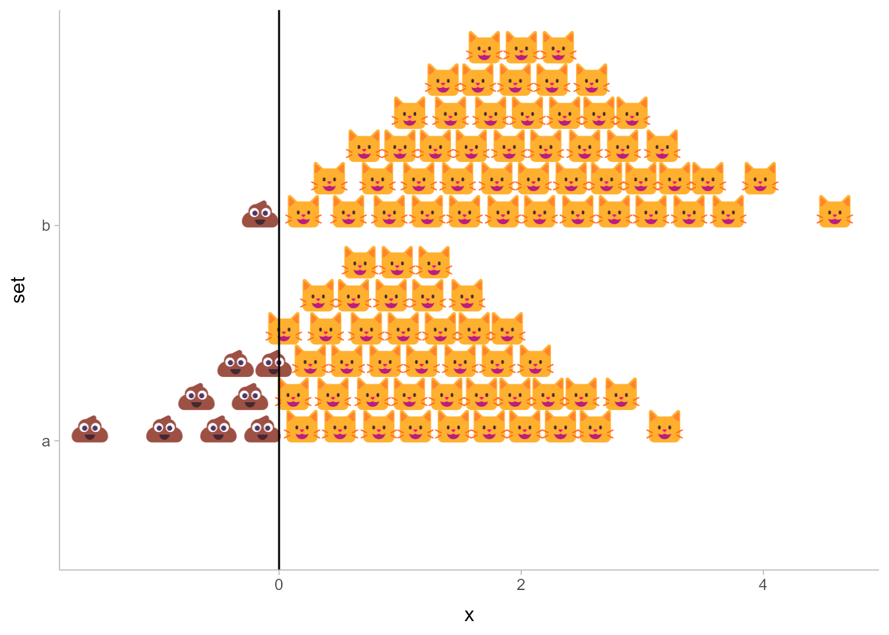

Dotplots of Wee People
================
Matthew Kay
2022-04-27

## Introduction

This demo shows the use of the [Wee People
font](https://github.com/propublica/weepeople) from ProPublica with
`geom_dots()` from [ggdist](https:://mjskay.github.io/ggdist). The idea
of using Wee People with dotplots comes from @gdbassett, and the code is
based on [@hrbrmstr’s example
code](https://twitter.com/hrbrmstr/status/1363241620527808514?s=20&t=Dz0e9sEqPYg8d5J5_37fDQ)
for using custom fonts in ggplot.

## Setup

The dev version of `ggdist` is needed to run this example. Install it
with:

``` r
remotes::install_github("mjskay/ggdist")
```

These libraries are needed:

``` r
library(systemfonts)
library(ggplot2)
library(ggdist)

theme_set(theme_ggdist())
```

``` r
knitr::opts_chunk$set(dev = "png", dev.args = list(png = list(type = "cairo")))
```

## Font setup

Download the Wee People font:

``` r
download.file(
  url = "https://github.com/propublica/weepeople/raw/master/weepeople.ttf",
  destfile = "weepeople.ttf"
)
```

And register it so we can use it with `family = "weepeople"`:

``` r
register_font(
  name = "weepeople",
  plain = "weepeople.ttf"
)
```

## Wee People Dotplots

An example with raw data using `geom_dots()`:

``` r
set.seed(1234)

df = data.frame(
  x = qnorm(ppoints(100), 1:2),
  set = c("a", "b"),
  icon = factor(sample(52, 100, replace = TRUE))
) 

# the lower and upper case letters in the Wee People font are people:
people = c(letters, toupper(letters))

df |>
  ggplot(aes(x = x, y = set, group = set, shape = icon)) + 
  geom_dots(family = "weepeople") + 
  scale_shape_manual(values = people, guide = "none")
```


Notice how the people are spaced out horizontally. This is because
compared to normal dots, which have a square aspect ratio, they are
quite tall. With `geom_dots()`, `stackratio` determines vertical
stacking and `dotsize` horizontal spacing, so if we increase `dotsize`
we can make them be spaced closer together (fortunately the automatic
bin width selection algorithm will account for this and adjust binwidth
accordingly):

``` r
df |>
  ggplot(aes(x = x, y = set, group = set, shape = icon)) + 
  geom_dots(family = "weepeople", dotsize = 2.4) + 
  scale_shape_manual(values = people, guide = "none")
```


We can also make it feel a bit more organic using the `"swarm"` layout:

``` r
df |>
  ggplot(aes(x = x, y = set, group = set, shape = icon, color = x > 0)) + 
  geom_dots(family = "weepeople", dotsize = 2.4, layout = "swarm")+#, binwidth = 0.145) + 
  scale_shape_manual(values = people, guide = "none") +
  scale_color_brewer(palette = "Set1", guide = "none")
```


For completeness, an example with an analytical distribution using
`stat_dots()`:

``` r
data.frame(x = distributional::dist_normal(0,1)) |>
  ggplot(aes(xdist = x, shape = stat(factor(1:50)))) + 
  stat_dots(quantiles = 50, family = "weepeople", dotsize = 2.4) + 
  scale_shape_manual(values = people, guide = "none")
```


## Bonus

Bonus: emoji dotplots using {ragg}

``` r
ragg::agg_png("weepeople_dotplots_files/emoji-ragg.png", width = 1344, height = 960, res = 200)
print(df |>
  ggplot(aes(x = x, y = set, group = set, color = x > 0)) + 
  geom_dots(aes(shape = x > 0), layout = "weave", dotsize = 0.9, stackratio = 1.1, fill = NA, position = position_nudge(x = 0.07)) + 
  scale_shape_manual(values = c("💩", "😺"), guide = "none") +
  scale_color_brewer(palette = "Set1", guide = "none")) +
  geom_vline(xintercept = 0)
dev.off()
```

    ## png 
    ##   2


